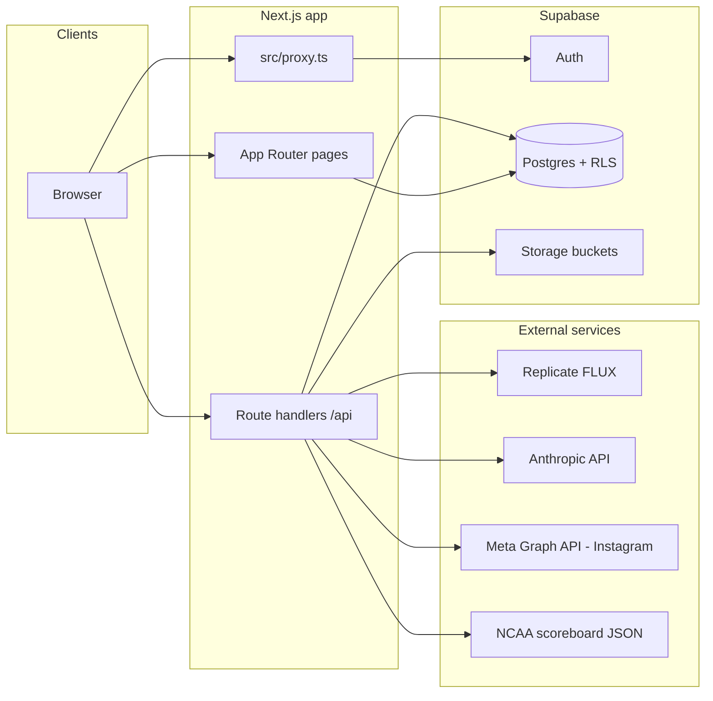

# Sideline Studio — Architecture

This document describes how **Sideline Studio** is put together: the product surfaces, the Next.js application structure, Supabase as the system of record, and the main integrations.

For database setup steps, see [docs/SUPABASE_SETUP.md](docs/SUPABASE_SETUP.md).

---

## 1. Product overview

Sideline is an **AI-assisted athletics marketing** app with **role-based portals**:

| Role      | Primary routes              | Purpose |
|-----------|-----------------------------|---------|
| Designer  | `/designer`, `/designer/create` | Create assets, optional Instagram publish |
| Athlete   | `/athlete`                  | Review and react to published assets |
| Student   | `/feed`                     | Browse the public-style feed |

A parallel **manager** workflow (schools, teams, rosters, schedules, drafts, editor) lives under `/manager` and related Supabase tables; it shares the same auth and asset model where appropriate.

---

## 2. System context



---

## 3. Technology stack

| Layer | Choice |
|-------|--------|
| Framework | **Next.js 16** (App Router), **React 19**, **TypeScript** |
| Styling | **Tailwind CSS 4**, shared UI primitives under `src/components/ui/` |
| Auth & data | **Supabase** (`@supabase/supabase-js`, `@supabase/ssr`): Auth, Postgres, Row Level Security, Storage |
| Validation | **Zod** (e.g. `/api/generate` request bodies) |
| Client state | **Zustand** (persisted local store; complements Supabase-backed pages) |
| Image generation (server) | **Replicate** (FLUX family); prompts may involve **Anthropic** per route implementation |
| Optional / listed in package.json | `next-auth`, `@prisma/client`, `@tanstack/react-query` are present as dependencies but **not wired** through the current application source |

Build tooling includes **ESLint**, **Vitest** for unit tests under `src/lib/**`, and the **React Compiler** enabled in `next.config.ts`.

---

## 4. Application structure

```
src/
  app/                 # App Router: layouts, pages, route handlers
    api/               # Server-only HTTP handlers (generate, Instagram, live scores)
    auth/              # Sign-in UI + OAuth callback route
    designer/          # Designer portal + asset creation
    athlete/, feed/    # Athlete and student feeds
    manager/           # School/team/schedule + editor pipeline
    settings/          # Profile settings
  components/          # Feature UI (navbar, editor, schedule importer, pipeline wizard)
  lib/
    supabase/          # Browser + server Supabase clients; domain helpers (assets, teams, …)
    prompt/            # Prompt compilation for image/caption flows
    editor/              # Layout/copy builders for post editor
    schedule/           # CSV parsing and column mapping
    imageGen/           # Stub image provider (legacy/alternate path)
    instagram/          # Token encryption helpers for stored IG credentials
    pipeline/           # Types and fixtures for manager pipeline
    types.ts            # Shared types + minimal Database typing for Supabase
    store.ts            # Zustand designer/feed-oriented client store
  proxy.ts              # Next.js 16 “proxy” (session refresh + route guards)
```

### 4.1 Request boundary: `src/proxy.ts`

The project uses Next.js 16’s **`proxy.ts`** convention (replacing the older `middleware.ts` name in this stack). It:

- Refreshes the Supabase session via `getUser()` and cookie plumbing from `createServerClient`.
- Redirects **unauthenticated** users away from protected path prefixes (`/designer`, `/athlete`, `/feed`) to `/auth`.
- Redirects **authenticated** users on `/auth` to their role home (unless query flags request the auth UI).
- Redirects users who land on the **wrong portal** for their `profiles.role`.

`DEV_BYPASS_AUTH=true` skips these checks when Supabase env is present (useful for local development).

### 4.2 Server vs client

- **Route handlers** under `src/app/api/**` run on the server, hold secrets (API keys), and talk to Supabase with the server client or service patterns as implemented per route.
- **Pages** use server components where feasible; interactive flows (designer create, editors) use client components with the browser Supabase client where needed.

---

## 5. Data model (Supabase)

Canonical schema is **`supabase-schema.sql`**. Major groupings:

### 5.1 Identity and profiles

- **`auth.users`** — Supabase-managed identities.
- **`public.profiles`** — `id` → `auth.users`, `role` (`designer` \| `athlete` \| `student`), `full_name`, `email`. Populated by trigger **`handle_new_user`** from signup metadata.

### 5.2 Manager / program data

Scoped to a **school owner** (`schools.manager_id`):

- **`schools`**, **`teams`**, **`athletes`**, **`schedules`** — roster and calendar data.
- **`logos`** — metadata rows pointing at Storage paths.
- **`manager_drafts`** — persisted generation requests, compiled prompts, editor JSON.
- **`draft_reference_images`** — reference assets tied to drafts.

RLS policies generally restrict these rows to the owning manager (via school membership).

### 5.3 Published content and engagement

- **`assets`** — designer-owned creative records: type (`gameday`, `final-score`, `poster`, `highlight`), status (`draft`, `published`, `archived`), scores, dates, optional links to school/team/schedule, `image_url` / `image_storage_path`.
- **`asset_likes`** — composite key `(asset_id, user_id)` for athlete/student engagement.

RLS on `assets` and `asset_likes` is defined in the schema so feeds and mutations respect visibility rules at the database layer.

### 5.4 Instagram

- **`instagram_accounts`** — one row per app user: Meta Instagram user id and **encrypted** long-lived token; used by publish API routes after decryption server-side.

### 5.5 Storage

Reference uploads for generation use a dedicated bucket (see `GENERATION_REFERENCES_BUCKET` in `src/lib/supabase/referenceUpload.ts`). The **`/api/generate`** route only accepts HTTPS reference URLs under that bucket on the project’s Supabase host, so the server cannot be abused as an open image proxy.

---

## 6. Major API routes

| Route | Role |
|-------|------|
| **`POST /api/generate`** | Validates body with Zod; builds prompts; calls **Replicate** (and related helpers); returns generated image URL. Sanitizes `referenceImageUrls` to Supabase public object URLs only. |
| **`GET /api/live-scores`** | Fetches and normalizes **NCAA** scoreboard JSON for live/final game display. |
| **Instagram** (`/api/instagram/*`) | OAuth connect/callback, connection status, and **publish** (Graph API: create media + publish) using decrypted tokens from `instagram_accounts`. |

Other pages call Supabase **directly from the browser or server** for CRUD on profiles, assets, and manager entities, relying on RLS for authorization.

---

## 7. AI and content pipeline (conceptual)

1. **Inputs**: Sport, teams, scores, dates, optional style fields, refinement messages, optional **reference images** (hosted on Supabase Storage).
2. **Server composition**: Prompt strings are assembled (see `src/lib/prompt/*` and the generate route).
3. **Image output**: Primary path uses **Replicate** output URLs (allowed in `next.config.ts` `images.remotePatterns` alongside other CDNs).
4. **Persistence**: Designer flows persist **assets** (and related rows) in Postgres; local/editor state may also use **`manager_drafts`** or client **Zustand** depending on the screen.

`src/lib/imageGen/provider.ts` provides a **stub** image URL for non-Replicate testing; production imagery is expected to flow through `/api/generate`.

---

## 8. Security model

- **RLS** is the primary enforcement mechanism for multi-tenant data (managers vs each other; users vs profiles).
- **Anon key** is used in browser and server clients; no service-role client appears required for normal user flows in the documented schema.
- **Instagram tokens** are stored encrypted; decryption happens only on the server for publish.
- **Generate route** restricts reference images to known Supabase paths to avoid SSRF/open proxy behavior.

---

## 9. Configuration and environment

Typical variables (names only; values belong in `.env.local` — not committed):

- `NEXT_PUBLIC_SUPABASE_URL`, `NEXT_PUBLIC_SUPABASE_ANON_KEY` — required for auth and data.
- Replicate / Anthropic keys as consumed by `src/app/api/generate/route.ts`.
- Meta / Instagram app credentials for OAuth and publishing (see Instagram route handlers).
- `DEV_BYPASS_AUTH` — optional developer bypass for `proxy.ts` behavior.

---

## 10. Testing and quality

- **Vitest** targets library code: Supabase helpers, parsers, prompt compilers, crypto, editor builders, etc.
- **`npm run lint`** — ESLint with Next.js config.

---

## 11. Known gaps and evolution (as of this repo)

- Route protection is implemented in **`proxy.ts`**, but complex edge cases (deep links, new routes) should be regression-tested when adding pages.
- README notes **storage/reference uploads** may be partial in some UX paths; generation already assumes references can be served from the references bucket when provided.
- **Prisma / NextAuth / React Query** are not part of the active architecture; prefer Supabase clients and existing patterns unless a deliberate migration adds them.

---

## 12. Related documents

- [docs/SUPABASE_SETUP.md](docs/SUPABASE_SETUP.md) — project setup against Supabase.
- [README.md](README.md) — quickstart, role routing summary, and repo map.
